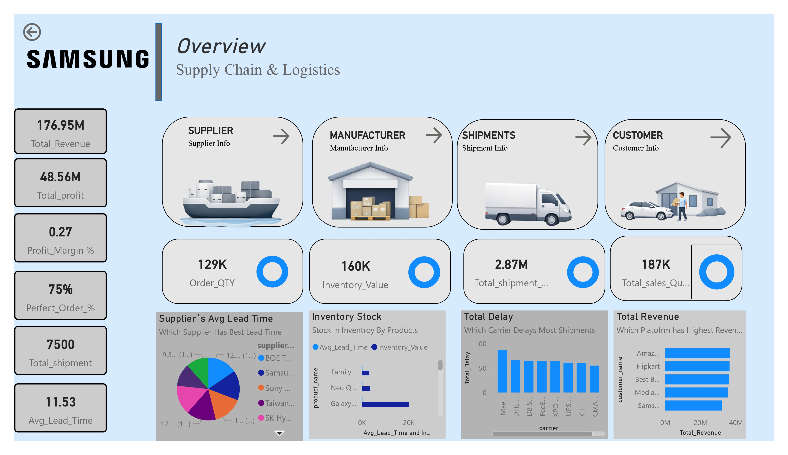
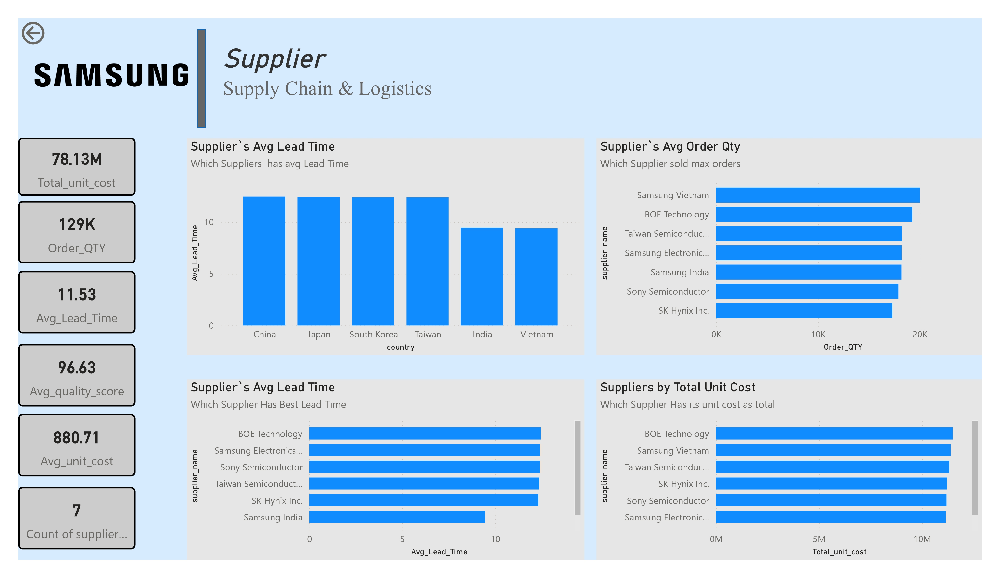
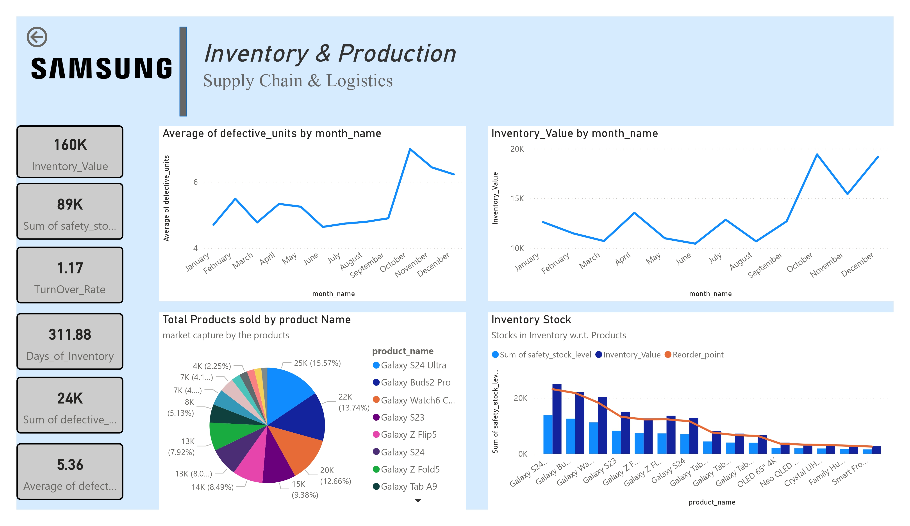
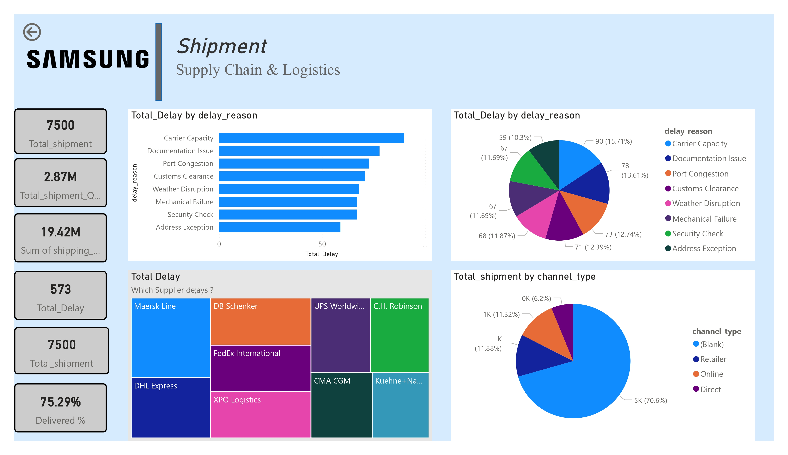
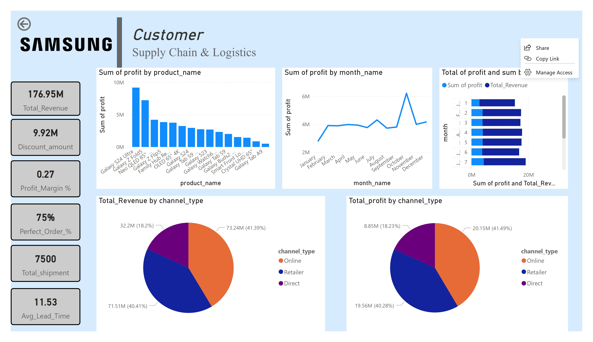

# 📊 Samsung Supply Chain & Logistics Analytics Dashboard

🚀 **End-to-End Industry Level Power BI Analytics Project**
This project presents a professional Supply Chain & Selling Analytics Dashboard designed for a Samsung consumer electronics business scenario. The dashboard integrates supplier performance, inventory management, shipment tracking, and sales analytics into a single interactive reporting solution to support data-driven decision-making.

---

## 🔎 Project Overview

Modern supply chain and sales ecosystems generate large volumes of operational data. This Power BI dashboard transforms raw datasets into meaningful KPIs and visual insights, enabling stakeholders to monitor revenue trends, logistics efficiency, inventory health, and customer sales performance.

---

## 🎯 Key Features

* 📌 Executive KPI Overview (Revenue, Profit, Shipments, Lead Time)
* 📦 Supplier Performance & Procurement Analysis
* 🏭 Inventory & Production Monitoring
* 🚚 Shipment & Logistics Performance Tracking
* 💰 Sales & Revenue Analytics by Channel & Product
* 📊 Interactive Filters and Business Storytelling

---

## 🛠️ Tech Stack

* **Microsoft Power BI**
* **DAX (Data Analysis Expressions)**
* **Power Query (ETL)**
* **Data Modeling – Star Schema**
* **Python**
* **MySQL**

---

## 📈 Dashboard Modules

### 1️⃣ Overview

High-level KPIs including Total Revenue, Profit Margin, Perfect Order %, Total Shipments, and Avg Lead Time.

### 2️⃣ Supplier Analytics

Evaluates supplier lead time, order quantity, and procurement cost to identify reliable vendors.

### 3️⃣ Inventory & Production

Tracks inventory value, defective units, turnover rate, and product-wise performance.

### 4️⃣ Shipment & Logistics

Analyzes delivery delays, carrier performance, and shipment channels.

### 5️⃣ Selling Analytics

Provides revenue insights by platform, product profitability, and monthly sales trends.

---

## 🖼️ Dashboard Preview

Add your screenshots inside the **assets** folder.







---

## 📂 Project Structure

```
Samsung-SupplyChain-Selling-Analytics/
│
├── Samsung Supply Chain & Logistics Analytics Dashboard .pbix
├── Project_Report.pdf
├── Problem_Statement.md
├── 
└── README.md
```

---

## ▶️ How to Use

1. Clone this repository.
2. Open the `.pbix` file using **Microsoft Power BI Desktop**.
3. Refresh the data model if required.
4. Navigate through dashboard pages for insights.

---

## 👨‍💻 Author

**Shivansh Saxena**
B.Tech CSE (AI) | Data Analytics & Power BI Enthusiast

---

## ⭐ Project Goal

The objective of this project is to simulate a real-world enterprise analytics environment by combining supply chain operations and sales intelligence into a centralized business intelligence dashboard.
